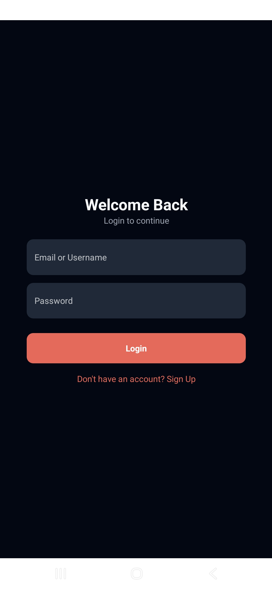
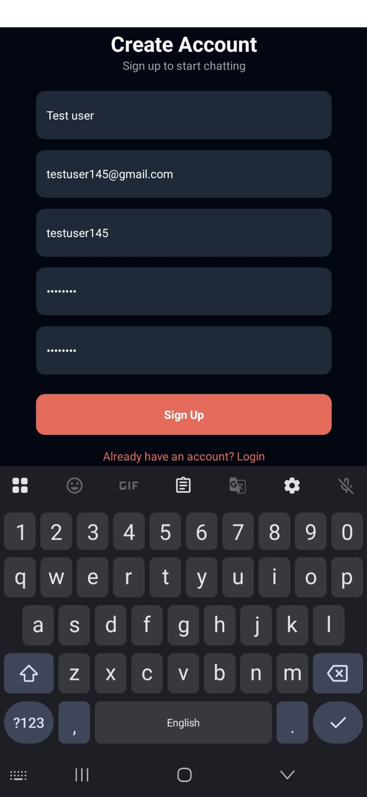
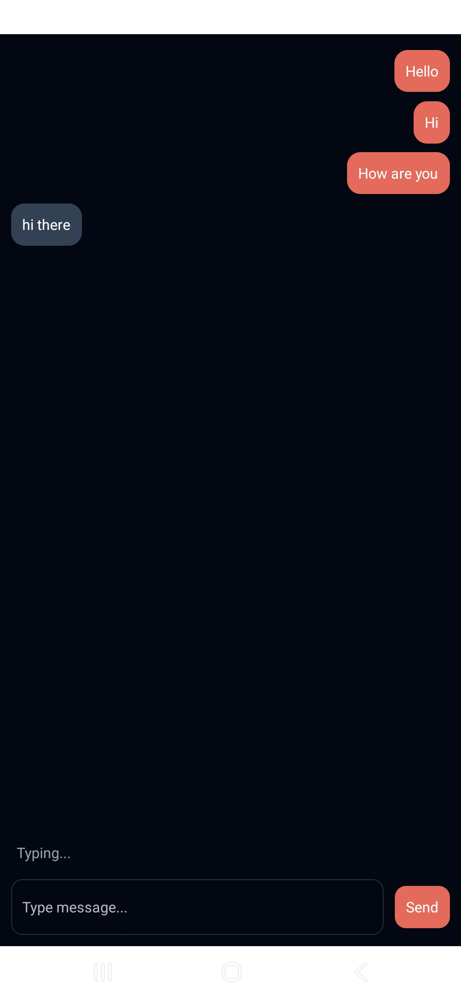
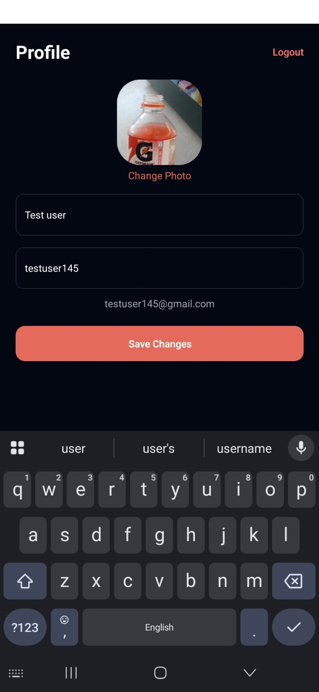

# 💬 Roger - Real-time Chat App

Roger is a real-time chat application built with React Native and Firebase.

It supports authentication, real-time messaging, user profiles, and media sharing. The app uses Firebase Firestore for chat data and Firebase Auth for secure login.

---

## 🚀 Features

- 🔐 Firebase Authentication (Email/Password)
- 💬 Real-time chat using Firestore
- 👤 User profiles with image upload
- ⚡ Fast and responsive UI
- 📱 Cross-platform

---

## 🛠 Tech Stack

- React Native
- Firebase (Auth, Firestore)
- React Navigation
- React Native Bootsplash
- React Native Keychain (secure storage)
- JavaScript / TypeScript

---

## 📸 Screenshots

<p align="center">
  
  
  
</p>

<p align="center">
  
  
  
</p>

---

## 📦 Setup

```bash
npm install
npx react-native run-android
```
